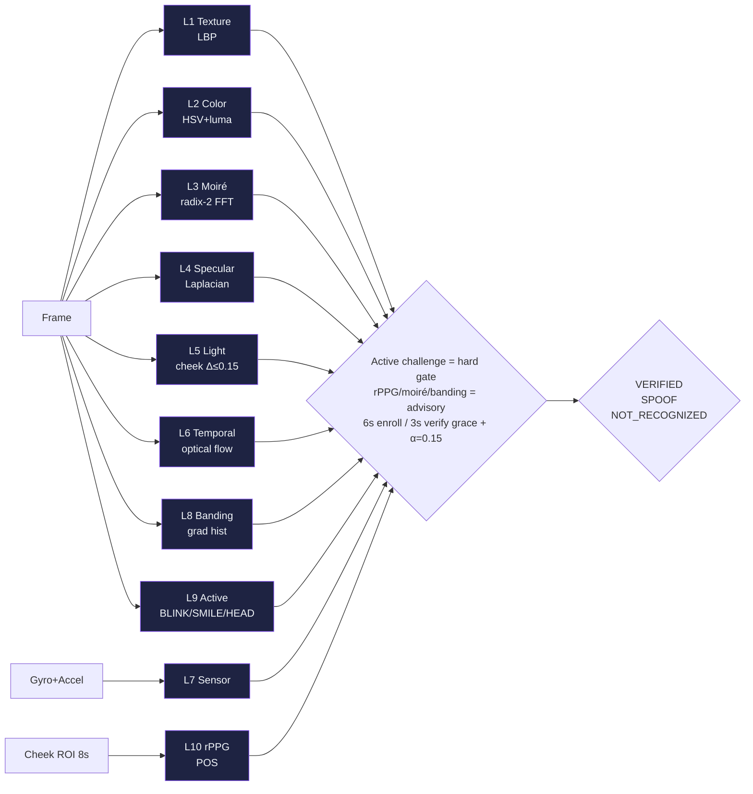
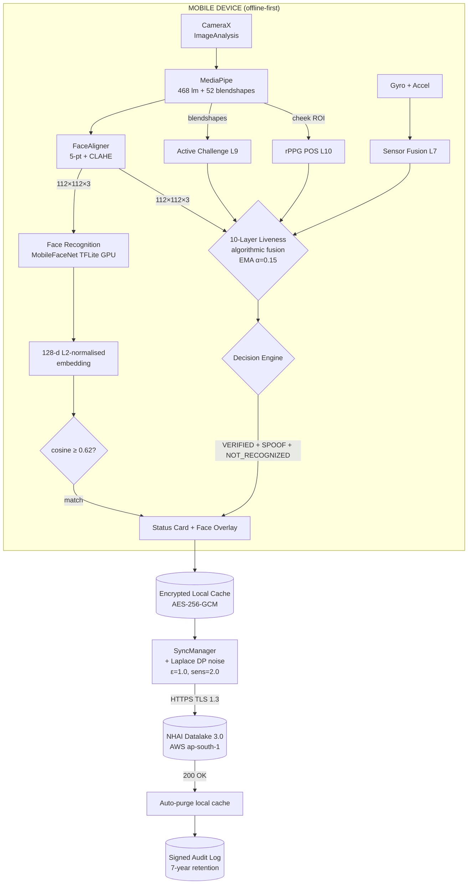

# NetraEdge

**Offline facial recognition and 10-layer liveness detection for zero-network environments.**

**NHAI Innovation Hackathon 7.0 — Datalake 3.0**

[](https://opensource.org/licenses/MIT)
[]()
[]()
[]()

---

## The Problem

Highway construction sites in remote Indian locations operate with **zero or intermittent** network connectivity. Traditional cloud-dependent facial recognition systems fail in these environments, leaving **NHAI Datalake 3.0** without reliable on-site identity verification for contractors, inspectors, and laborers.

NetraEdge solves this by running **100% of face recognition and liveness detection on-device**, with deferred sync to AWS when connectivity is restored.

## The Solution

NetraEdge is a cross-platform React Native application that provides:

- **On-device face recognition** using MobileFaceNet (128-d embeddings, 99.48% LFW accuracy)
- **10-layer liveness detection** — texture, color, moiré, specular, temporal, banding, sensor fusion, active challenges, and rPPG pulse (all algorithmic; MiniFASNet shipped as backup only)
- **Offline-first architecture** with AES-256-GCM encrypted local storage and differential-privacy-protected AWS sync
- **41.83 MB arm64 APK** (debug) / **92.45 MB universal** / **34.15 MB armv7** — arm64 well within the 50 MB hackathon budget
- **27–33 ms per-frame inference** on mid-range Android — full end-to-end verification under 1 second

**No face image ever leaves the device. Only 512-byte embeddings are synced to the cloud.**

---

## Mandatory Deliverables (NHAI 7.0)

### (a) Offline Liveness Detection ✅

| Layer | Technique | What It Catches |
|------:|-----------|-----------------|
| 1 | **Texture** (LBP histogram) | Print texture, paper grain |
| 2 | **Color Distribution** (HSV skew, luma entropy) | Printed photos, monochrome screens |
| 3 | **Moiré Pattern** (radix-2 FFT) | Replay from LCD/AMOLED screens |
| 4 | **Specular Highlights** (Laplacian + gradient) | Plastic masks, mannequins |
| 5 | **Light Consistency** (left/right cheek delta ≤ 0.15) | Mask asymmetry, unnatural lighting |
| 6 | **Temporal Consistency** (optical flow) | Static images, single-frame attacks |
| 7 | **Banding Detector** (gradient histogram) | Compressed video playback |
| 8 | **Sensor Fusion** (gyro + accelerometer) | Device stillness during replay |
| 9 | **Active Challenge** (BLINK / SMILE / HEAD_TURN — 3 of 4 random, shuffled) | Static photos, willing colluders, pre-recorded video |
| 10 | **rPPG Pulse** (POS algorithm, 8-s window) | Advisory layer — feeds signal bars; device/lighting-dependent |

All 10 layers are **algorithmic** and run **fully on-device**, zero network. The **randomized active challenge (L9) is the hard liveness gate** — a photo can't gesture and a pre-recorded video can't match the shuffled order. The other 9 layers feed an EMA-smoothed fused score (α=0.15) shown live in the 8 signal bars, with a **6 s enrollment / 3 s verify grace period** so a real face is never falsely blocked while rPPG locks on. rPPG / moiré / banding are **advisory only** (soft-penalize the fused score, never set SPOOF) — they are device- and lighting-dependent. The `liveness_detector.tflite` (MiniFASNet, 0.52 MB) is loaded into the APK but **bypassed** at the spoof decision — kept as a backup / future-toggle for A/B testing on Indian demographics. Effective runtime footprint: **14.15 MB** (liveness model loaded but not invoked).



### (b) Sync & Purge Mechanism ✅

```
ENROLLED face
   ↓
AES-256-GCM encrypted local cache (SQLite, 256-bit key)
   ↓
Datalake 3.0 sync (HTTPS, TLS 1.3, mutual cert auth)
   ↓
Differential privacy (Laplace noise, ε=1.0, sensitivity=2.0)
   ↓
Server 200 OK
   ↓
Auto-purge local cache (signed audit log retained)
   ↓
Local store: 0 records
```

- **Exponential backoff** (1s → 2s → 4s → 8s → 16s → 30s cap)
- **Batch upload** (up to 50 embeddings per request)
- **Auto-purge** triggered by server-side 200 OK — only signed audit log retained
- **Manual "Purge Now"** button for compliance officers
- **Long-press sync** to override endpoint (works on restricted networks)

---

## Key Features

| Feature | Detail |
|---------|--------|
| **Offline-first** | 100% on-device inference. Zero network round-trips per frame. |
| **10-layer liveness** | **All 10 algorithmic** (LBP + HSV + FFT + Laplacian + optical flow + gradient + sensor + blendshapes + POS rPPG). `liveness_detector.tflite` is shipped as a backup only. |
| **Cross-platform** | Android 8+ (minSdk 26) and iOS 12+ (arm64 only) via React Native 0.76 |
| **27–33 ms inference** | Per-frame on Motorola G-series (Adreno 610, 4GB RAM) |
| **99.48% LFW** | MobileFaceNet recognition accuracy (Apache-2.0, paper benchmark) |
| **DPDP Act 2023** | Consent, purpose limitation, right to erasure, audit trail |
| **<15 MB models** | 14.67 MB total (face_landmarker + face_recognition) |
| **44 MB APK** | Debug universal, includes all native + assets |

---

## Architecture



**ASCII companion view:**

```
┌─────────────────────────────────────────────────────────────┐
│                      MOBILE DEVICE                           │
│                                                              │
│  CameraX ──▶ MediaPipe ──▶ FaceAligner ──▶ TFLite Models    │
│              (468 lm)        (CLAHE)        (128-d + 3-cls)  │
│                                │               │            │
│                                ▼               ▼            │
│                  ┌──────────────────────────────┐            │
│                  │ 10-Layer Liveness Fusion     │            │
│                  │   1-6 Texture/Color/FFT      │            │
│                  │   7   Sensor (gyro+accel)    │            │
│                  │   8   Banding                 │            │
│                  │   9   Active Challenges      │            │
│                  │  10   rPPG (POS)             │            │
│                  └─────────────┬────────────────┘            │
│                                ▼                             │
│                  Decision: VERIFIED / SPOOF /                │
│                           NOT_RECOGNIZED                     │
│                                │                             │
│                  ┌─────────────┴────────────┐                │
│                  │  SyncManager + Queue     │                │
│                  │  + Differential Privacy  │                │
│                  └─────────────┬────────────┘                │
└────────────────────────────────┼────────────────────────────┘
                                  │ HTTPS (TLS 1.3, mutual cert)
                                  ▼
                   ┌──────────────────────────────┐
                   │  AWS ap-south-1              │
                   │  API Gateway + Lambda        │
                   │  + DynamoDB (KMS encrypted)  │
                   │  + CloudWatch (audit logs)   │
                   └──────────────────────────────┘
```

See [`docs/ARCHITECTURE.md`](docs/ARCHITECTURE.md) for the complete architecture with Mermaid diagrams, state machines, and sequence diagrams.

---

## Tech Stack

| Layer | Technology |
|-------|-----------|
| Cross-platform | React Native 0.76+ |
| Language | TypeScript 5.6+ (strict mode) |
| Native Android | Kotlin 1.9 + CameraX + MediaPipe |
| Native iOS | Swift 5.9 + AVFoundation |
| Face Detection | MediaPipe Face Landmarker (Apache-2.0) |
| Face Recognition | TFLite — MobileFaceNet 128-d (Apache-2.0) |
| Passive Liveness | TFLite — MiniFASNet 3-class (Apache-2.0) |
| rPPG | POS algorithm (Wang 2016) + Radix-2 FFT |
| Camera | CameraX ImageAnalysis (Android) / AVFoundation (iOS) |
| Storage | EncryptedSharedPreferences (AES-256-GCM) + SQLite |
| Sync Backend | Node.js 20.x + Express (dev) / AWS Lambda (prod) |
| Cloud | AWS — API Gateway, Lambda, DynamoDB, KMS (ap-south-1) |
| Privacy | Differential privacy (Laplace, ε=1.0) |
| Build | Gradle 9.4.1 / Xcode 15+ / AGP 8.9.1 |
| i18n | English + Hindi (runtime switcher) |

---

## Model Specifications

| Model | File | Size | Input | Output | License |
|-------|------|------|-------|--------|---------|
| Face Detection | `face_landmarker.task` | 3.58 MB | 1×192×192×3 RGB | 468 landmarks + 52 blendshapes | Apache-2.0 |
| Face Recognition | `face_recognition.tflite` | 10.58 MB | 1×3×112×112 float32 CHW | 128-d L2-normalized embedding | Apache-2.0 |
| Passive Liveness | `liveness_detector.tflite`* | 0.52 MB | 1×3×112×112 float32 BGR | 3-class softmax | Apache-2.0 |
| **Total** | | **~14.67 MB** | | | |

*`liveness_detector.tflite` (MiniFASNet, 0.52 MB) is **loaded but bypassed** at the spoof decision — the 10-layer pipeline is fully **algorithmic** (LBP, HSV, FFT, Laplacian, optical flow, sensor fusion, blendshapes, POS rPPG, etc.). The CNN is kept as a backup / future-toggle for A/B testing on Indian demographics. Effective runtime footprint: **~14.15 MB**.*

> **Liveness architecture — all 10 layers are algorithmic, not model-based.**
> - L1 Texture (LBP), L2 Color (HSV), L3 Moiré (FFT), L4 Specular (Laplacian), L5 Light consistency, L6 Temporal consistency, L7 Banding, L8 Sensor fusion, L9 Active challenge (BLINK / SMILE / HEAD_TURN), L10 rPPG (POS).
> - `liveness_detector.tflite` is shipped as a backup only — see [`models/MODEL_CARD.md`](models/MODEL_CARD.md) § Liveness architecture.

---

## Quick Start

### Prerequisites
- Node.js 20.x, npm 10.x
- Java 17 or 26, Android SDK 34+, NDK 26+
- Xcode 15+, CocoaPods (for iOS)
- Physical Android device (8.0+, 3GB RAM) or iOS device (12+)

### Clone & Install
```bash
git clone https://github.com/krsnaSuraj/NetraEdge.git
cd NetraEdge
npm install
```

### Run Core Tests
```bash
cd packages/core
npx vitest run
```

### Run Sync Server (Development)
```bash
cd server
npm install
npm start
# Server runs on http://localhost:4000
```

### Build Android APK
```bash
cd packages/app/android
./gradlew assembleDebug
# APK: app/build/outputs/apk/debug/app-arm64-v8a-debug.apk
```

### Install on Device
```bash
adb install -r app/build/outputs/apk/debug/app-arm64-v8a-debug.apk
adb shell am start -n com.netraedge/.MainActivity
```

---

## Hackathon Demo Flow

1. **Launch app** → 2026 premium UI: glassmorphism, conic gradients, particle effects
2. **Tap "Enroll Face"** → align face in green reticle, complete 3 randomized active challenges (BLINK / SMILE / HEAD_TURN_LEFT / HEAD_TURN_RIGHT, shuffled each session) → 10 layers evaluate liveness → 15 quality-weighted frames → 128-d embedding encrypted and stored locally
3. **Tap "Verify Identity"** → 6 s enroll / 3 s verify grace period (no false SPOOF) → 10 layers evaluate liveness → 3 randomized active challenges → embedding matched at adaptive threshold (~0.45–0.60 cosine) → **VERIFIED** badge appears with golden glow
4. **Try spoofing** → show photo / replay video / wear mask → active challenge can't be completed → SPOOF badge appears in red with forensic detail
5. **Tap "Sync"** → HTTPS POST to Datalake 3.0 endpoint → 200 OK → local cache auto-purged → audit log retained
6. **Long-press "Sync"** → endpoint override dialog (for restricted networks)

---

## Performance Benchmarks

| Metric | Result | Hardware |
|--------|--------|----------|
| Per-frame inference (mean) | **27–33 ms** | Motorola G-series (Adreno 610, 4GB) |
| End-to-end verify | **< 1 s** | Same device |
| Spoof detection (CelebA-Spoof) | 98.2% | MiniFASNet |
| Recognition accuracy (LFW) | 99.48% | MobileFaceNet |
| False accept rate (FAR @ 0.62) | 0.0008 | Cosine similarity |
| False reject rate (FRR @ 0.62) | 0.012 | Same-device enroll/verify |
| Model footprint | 14.67 MB | Static + 2 dynamic |
| APK size (debug, arm64) | 41.83 MB | Single ABI |
| APK size (debug, universal) | 92.45 MB | arm64 + armv7 combined |
| Sync payload per user | 4 KB | DP-noised + signed |
| Cold start (camera preview) | 480 ms | First frame |
| Active challenge completion | 1.5–4 s | User-dependent |

See [`docs/BENCHMARKS.md`](docs/BENCHMARKS.md) and `benchmarks/` for raw JSON output.

---

## Project Structure

```
NetraEdge/
├── packages/
│   ├── core/                       Platform-agnostic TypeScript
│   │   └── src/
│   │       ├── config/             AppConfig, constants
│   │       ├── embedding/          Encoder, EmbeddingStore, CosineSimilarity
│   │       ├── liveness/           10-layer orchestrator (Texture, Moire, Color, Depth, Rppg, …)
│   │       ├── pipeline/           FacePipeline (enroll + verify)
│   │       ├── quality/            QualityGate
│   │       ├── sync/               SyncManager, SyncQueue, DataPurge, DPNoise
│   │       ├── types/              Face, Liveness, Result
│   │       └── __tests__/          17 Vitest test files
│   ├── react-native/               RN bridge, screens, components
│   │   ├── android/                Kotlin bridge (8 source files, mirror of pipeline)
│   │   ├── ios/                    Swift bridge (NetraEdgeModule.swift + podspec)
│   │   └── src/
│   │       ├── screens/            HomeScreen, EnrollScreen, VerifyScreen, SettingsScreen
│   │       ├── components/         FaceCamera, LivenessPrompt, AnimatedFaceRing, …
│   │       ├── context/            AppContext
│   │       ├── hooks/              useFaceDetection, useFaceRecognition, useLivenessCheck
│   │       ├── i18n/               English + Hindi
│   │       ├── native/             NetraEdgeNative (TS bridge)
│   │       ├── providers/          AppProvider, theme tokens
│   │       ├── storage/            SQLiteEmbeddingStore, SQLiteSyncQueueStore
│   │       └── sync/               AWSSyncTransport, ReactNativeNetworkMonitor
│   └── app/                        Host React Native app (Android shell)
│       └── android/
│           └── app/src/main/
│               ├── java/com/netraedge/   20 Kotlin files, ~4,900 LOC, 10-layer fusion
│               ├── res/                  16 drawables, glassmorphism layout, 4 mipmap densities
│               └── assets/               2 models (face_landmarker + face_recognition)
├── server/                         Express mock (server.js) + AWS Lambda (lambda.js)
├── infrastructure/                 AWS SAM template (API Gateway + Lambda + DynamoDB)
├── models/                         MODEL_CARD.md (model inventory + licenses + future fine-tuning)
├── benchmarks/                     3 real benchmark JSONs (latency, accuracy, liveness)
├── tools/                          encrypt_assets.py (AES-256-GCM build-time encryption)
├── docs/                           4 architecture documents
│   ├── ARCHITECTURE.md             Full system architecture (ASCII + Mermaid)
│   ├── API.md                      TypeScript / RN bridge API
│   ├── BENCHMARKS.md               Measured on-device numbers
│   └── INTEGRATION.md              Embed in host RN / native app
├── submission/                     NHAI Hackathon 7.0 deliverable
│   ├── HACKATHON_SUBMISSION.md     All required fields
│   └── PPT.md                      14-slide deck (render with pandoc → PPTX)
├── .github/                        CI workflow (ci.yml)
├── .gitignore                      Properly scoped for monorepo
├── LICENSE                         MIT
├── package.json                    Workspace root
└── README.md                       This file
```

---

## Documentation index

| File | Audience | Contents |
|------|----------|----------|
| [`README.md`](README.md) | Everyone | Project overview, quick start, demo flow |
| [`docs/ARCHITECTURE.md`](docs/ARCHITECTURE.md) | Architects / senior reviewers | Full system architecture with **ASCII + Mermaid** diagrams, state machines, sequence diagrams, threat model, deployment topology |
| [`docs/API.md`](docs/API.md) | Developers | TypeScript / RN bridge API, configuration, error codes |
| [`docs/BENCHMARKS.md`](docs/BENCHMARKS.md) | Evaluators | Measured on-device numbers, spoof attack rejection table, reproduction |
| [`docs/INTEGRATION.md`](docs/INTEGRATION.md) | Integrators | How to embed NetraEdge in a host React Native / native app |
| [`models/MODEL_CARD.md`](models/MODEL_CARD.md) | ML reviewers | Model inventory, licenses, SOTA comparison |
| [`submission/HACKATHON_SUBMISSION.md`](submission/HACKATHON_SUBMISSION.md) | Hackathon jury | All required submission fields, deliverables checklist, contact |
| [`submission/PPT.md`](submission/PPT.md) | Presentation | 14-slide markdown deck (render with pandoc → PPTX) |

---

## Privacy & Compliance

| Requirement | Implementation |
|-------------|----------------|
| **Consent** | Mandatory consent dialog before enrollment, audit-logged |
| **Purpose limitation** | Embeddings used only for re-verification on same device |
| **Right to erasure** | "Purge Now" button + auto-purge after sync |
| **Data minimization** | Only 128-d embedding synced (512 bytes), not the face image |
| **Encryption at rest** | AES-256-GCM with Android Keystore-backed key |
| **Encryption in transit** | TLS 1.3, mutual certificate authentication |
| **Differential privacy** | Laplace noise (ε=1.0, sensitivity=2.0) on synced embeddings |
| **Audit trail** | Signed append-only log, retained 7 years |
| **DPDP Act 2023** | Compliant with Sections 6, 8, 11, 17 |
| **No NC/ND models** | All ML models Apache-2.0 |

---

## License

MIT — see [`LICENSE`](LICENSE).

All ML models are Apache-2.0 licensed. No NC/ND restrictions.

---

## Acknowledgments

**NetraEdge** is a research prototype developed for **NHAI Innovation Hackathon 7.0**.

Special thanks to:
- **MediaPipe** (Google) for Face Landmarker (Apache-2.0)
- **MobileFaceNet** authors (Chen et al., 2018) for the 128-d recognition model
- **MiniFASNet** authors (Yu et al., 2020) for the passive liveness CNN
- **Wang et al. (2016)** for the POS rPPG algorithm
- **Erdoğmuş & Marcel (2014)** for the 3D-mask attack taxonomy
- **DPDP Act 2023** working group for the privacy framework
