# NetraEdge — System Architecture

## Overview

NetraEdge is a layered monorepo architecture designed for offline face recognition and liveness detection. The system follows clean architecture principles with dependency injection, functional error handling, and clear separation of concerns.

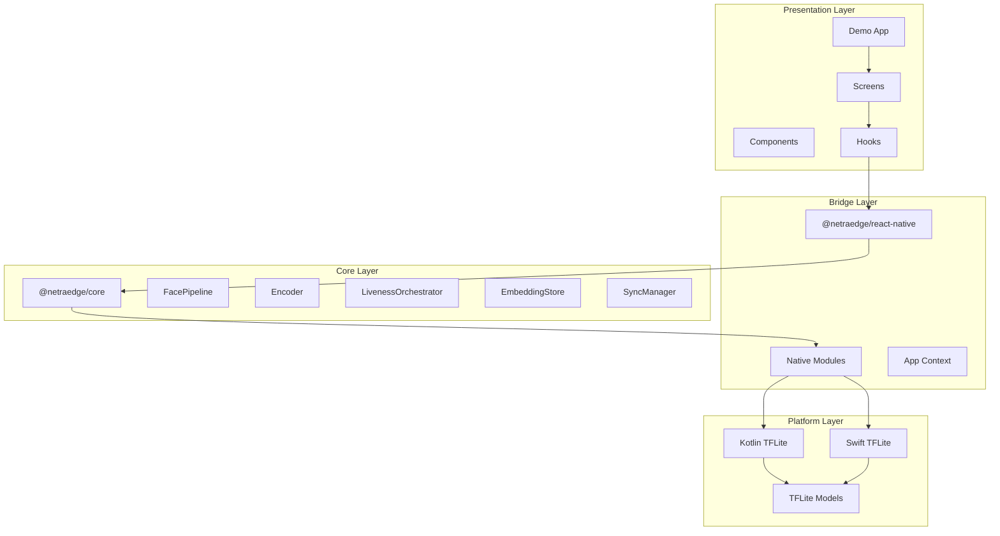

## Data Flow — Enrollment

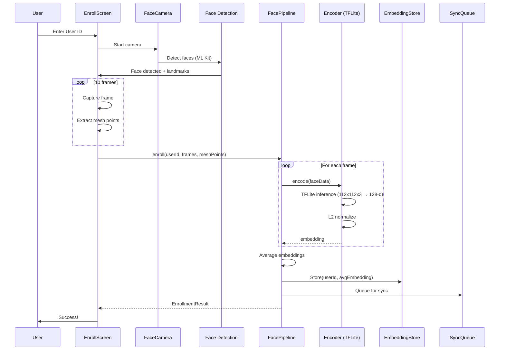

## Data Flow — Verification

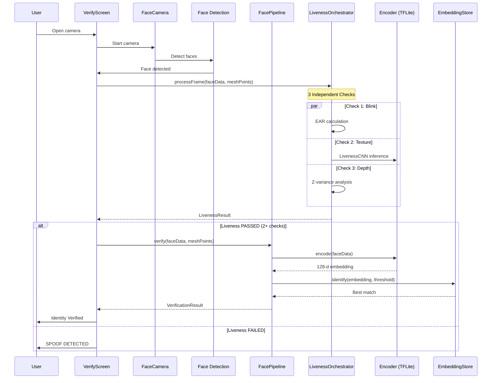

## Module Dependencies

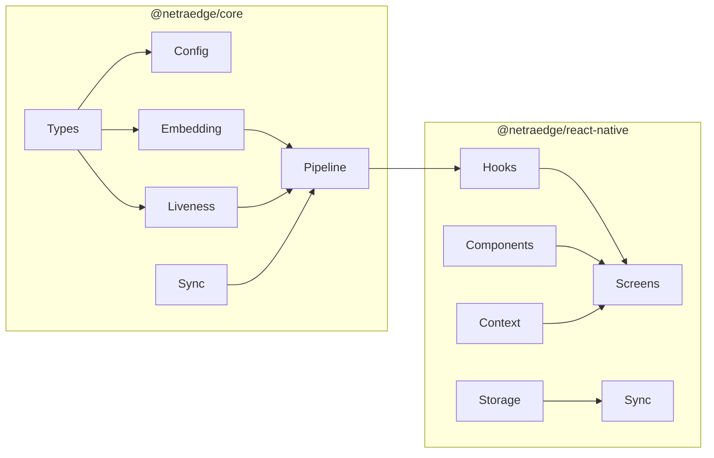

## Native Module Architecture

### Android (Kotlin)

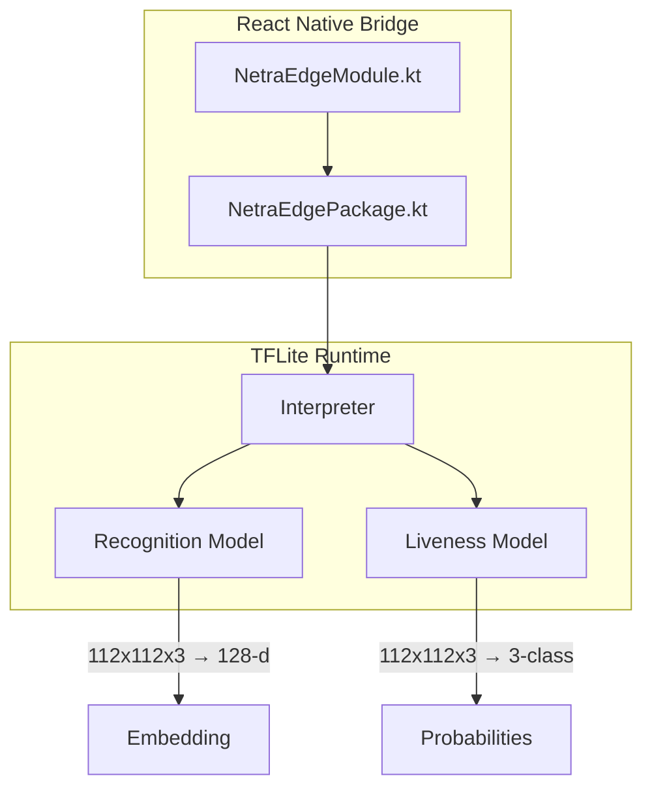

### iOS (Swift)

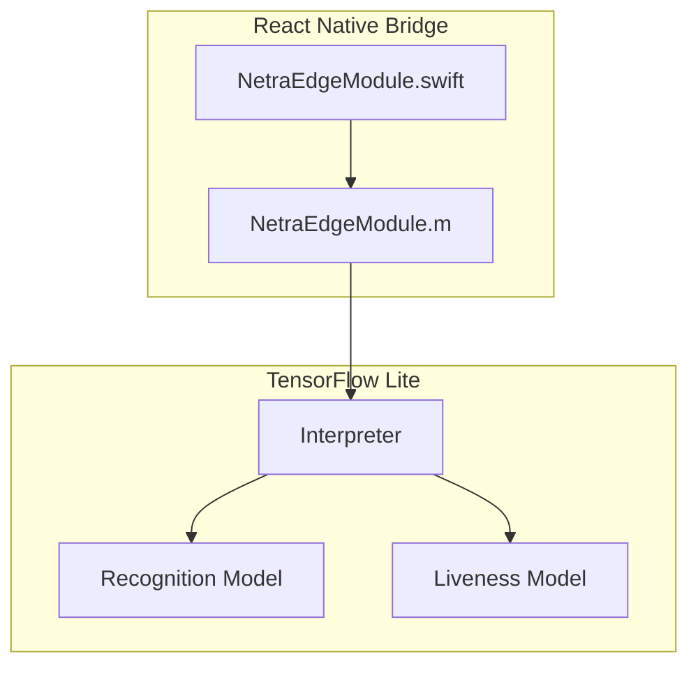

## Error Handling

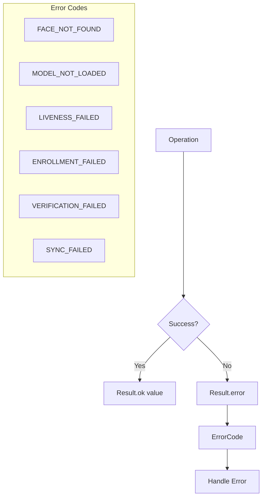

## Sync Architecture

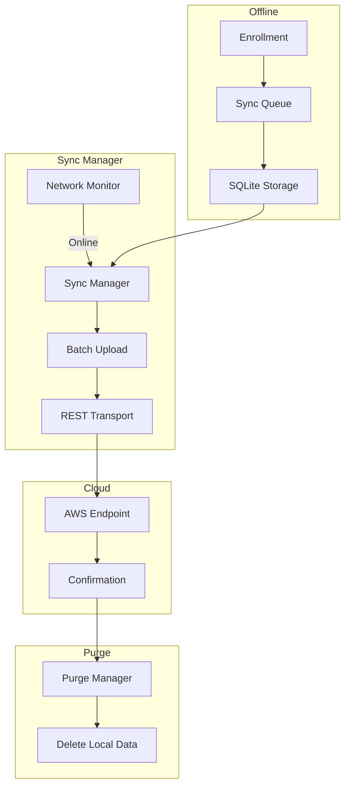

## Testing Strategy

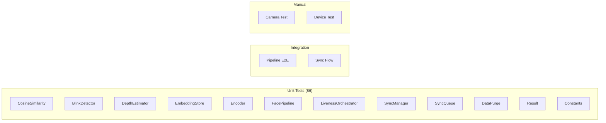

## Performance Characteristics

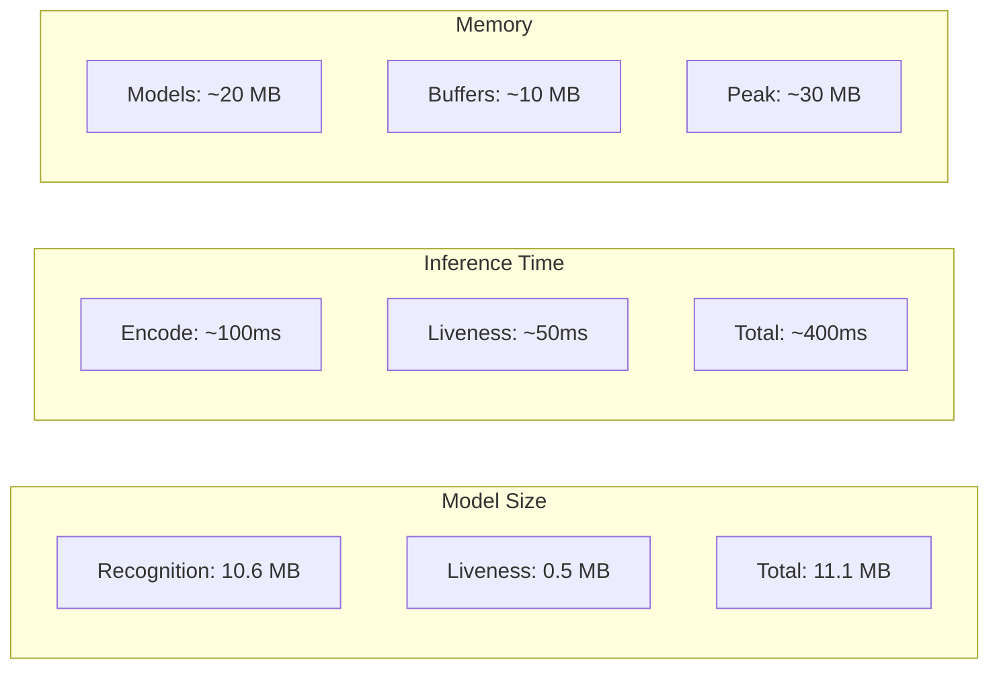

## Security Considerations

| Concern | Mitigation |
|---------|------------|
| Face data storage | L2-normalized embeddings only (not raw images) |
| Local storage | SQLite with app-private directory |
| Network sync | HTTPS with auth token |
| Model tampering | Models bundled in APK assets |
| Spoofing | Multi-modal liveness (blink + texture + depth) |

## Future Enhancements

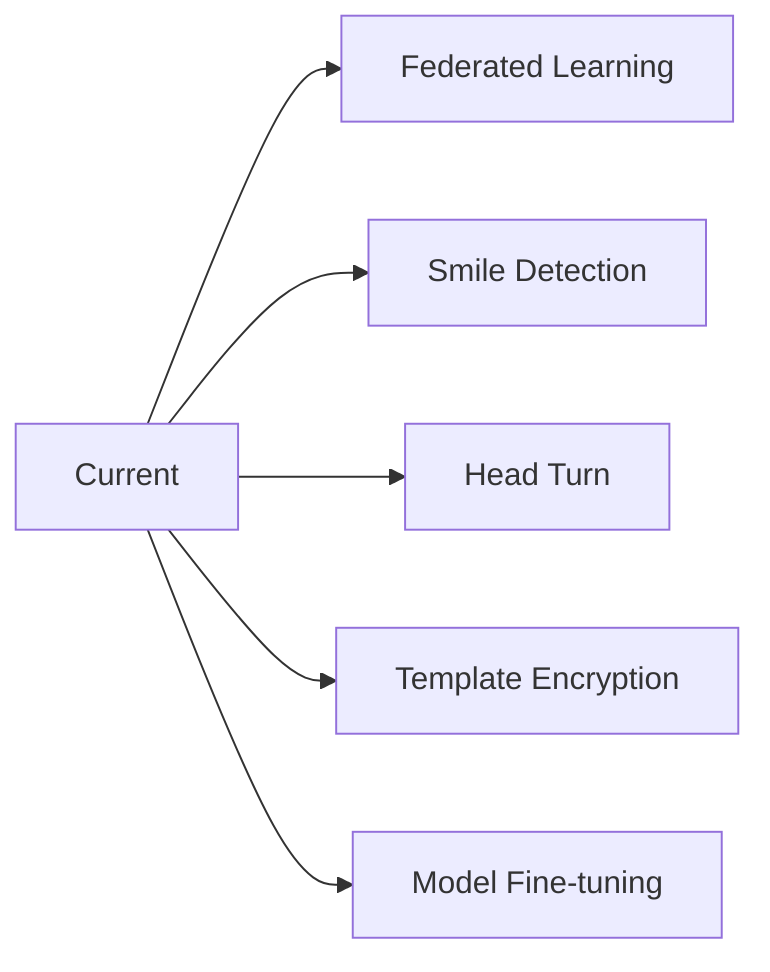

---

**NetraEdge** — Secure. Offline. Lightweight.

NHAI Hackathon 7.0 | Datalake 3.0 Integration
