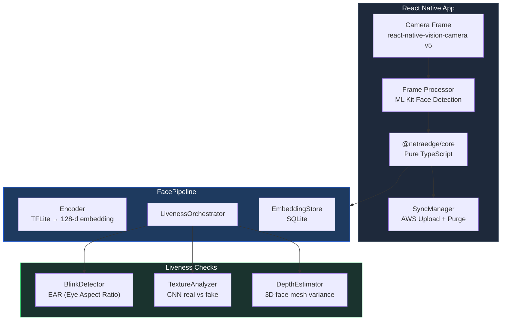
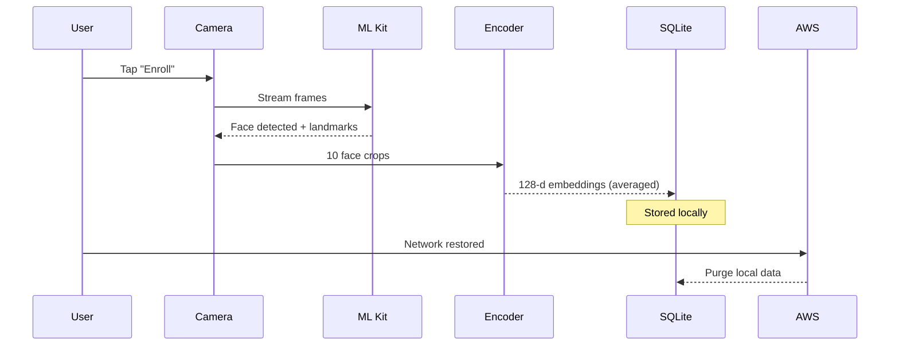
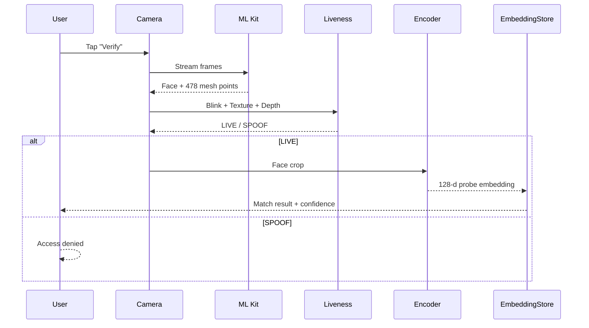
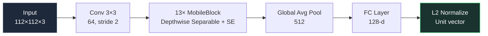
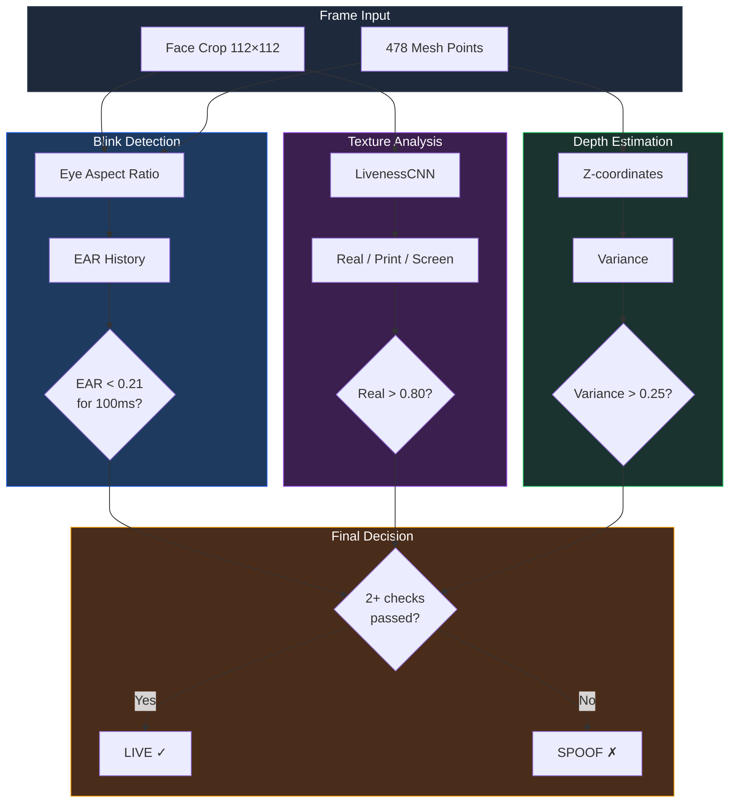
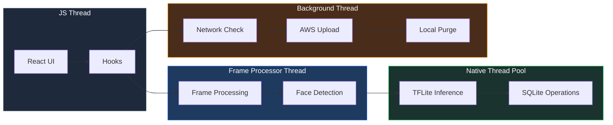
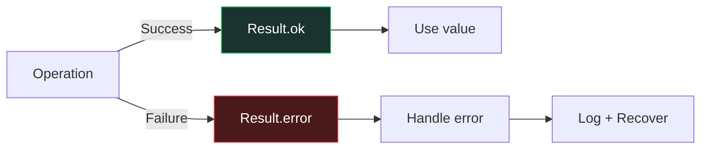

# NetraEdge — System Architecture

## Overview

NetraEdge is an offline-first facial recognition and liveness detection system designed for zero-network environments. It runs entirely on-device using lightweight TFLite models, with optional sync to AWS when connectivity is restored.

## System Architecture

## Data Flow

### Enrollment Flow

### Verification Flow

## Model Architecture

### MobileFaceNet (Face Recognition)

### Liveness Detection Pipeline

## Models

| Model | Architecture | Input | Output | Size (INT8) |
|-------|-------------|-------|--------|-------------|
| Face Recognition | MobileFaceNet | 112×112×3 | 128-d vector | ~4.8MB |
| Liveness Detection | Custom CNN | 112×112×3 | 3-class softmax | ~2.8MB |
| Face Detection | ML Kit BlazeFace | Variable | Bounding box + landmarks | Built-in |

**Total model size: ~7.6MB** (well under 20MB target)

## Concurrency Model

## Error Handling

All errors use the `Result<T, E>` pattern — no exceptions in business logic.
Error codes are structured enums for programmatic handling.

## Security

- All data stored locally on device
- No network calls without explicit user action
- Embeddings are L2-normalized (unit vectors)
- No raw images stored — only embeddings
- Sync uses TLS encryption
- Purge is immediate after successful upload
