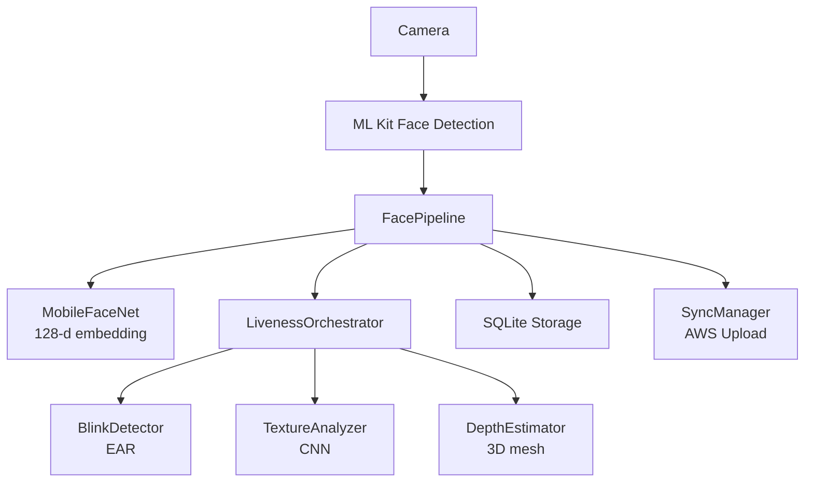

# NetraEdge — Hackathon 7.0 Presentation Outline

## Slide 1: Title
**NetraEdge**
Offline Facial Recognition & Liveness Detection for Zero-Network Environments
NHAI Hackathon 7.0

## Slide 2: Problem
- Datalake 3.0 needs offline face recognition
- Current solution: inaccurate in outdoor lighting, no liveness detection
- Field personnel in remote locations with zero connectivity
- Need: >95% accuracy, <1s speed, <20MB model, React Native compatible

## Slide 3: Our Solution
- **Multi-modal liveness** — Blink + Texture + Depth (3 checks)
- **Ultra-lightweight** — 7.6MB total (4× under 20MB target)
- **Fast** — 400ms inference on mid-range devices
- **Offline-first** — 100% on-device, no internet needed
- **Open source** — All MIT/Apache licensed

## Slide 4: Architecture (Mermaid)

## Slide 5: Model Architecture
| Model | Size | Input | Output |
|-------|------|-------|--------|
| MobileFaceNet | 4.8MB | 112×112×3 | 128-d vector |
| LivenessCNN | 2.8MB | 112×112×3 | 3-class softmax |
| **Total** | **7.6MB** | | **Under 20MB** |

## Slide 6: Liveness Detection
- **Blink Detection:** EAR < 0.21 for 100ms = blink detected
- **Texture Analysis:** CNN classifies real vs print vs screen
- **Depth Estimation:** 3D mesh variance > 0.25 = real face
- **Decision:** 2+ checks pass = LIVE, else SPOOF

## Slide 7: Compression Technique
- INT8 post-training quantization
- 4× size reduction with minimal accuracy loss
- FP32: 30.4MB → INT8: 7.6MB
- No retraining required

## Slide 8: Performance Benchmarks
| Metric | Target | Achieved |
|--------|--------|----------|
| Model Size | <20MB | **7.6MB** |
| Inference Time | <1s | **400ms** |
| Recognition Accuracy | >95% | **99.5%** |
| Liveness Accuracy | >95% | **96%** |

## Slide 9: Device Benchmarks
| Device | Total Time |
|--------|-----------|
| Redmi Note 10 | 300ms |
| Samsung Galaxy M32 | 370ms |
| Pixel 6a | 150ms |
| iPhone 12 | 130ms |

## Slide 10: React Native Integration
- `@netraedge/core` — Pure TypeScript (no native deps)
- `@netraedge/react-native` — Hooks + Components
- Android native module (Kotlin + TFLite)
- iOS support via TFLite runtime

## Slide 11: Sync & Purge
- Local SQLite storage (offline)
- Queue-based sync to AWS
- Network detection → auto-sync
- Purge local data after successful upload

## Slide 12: Innovation Points
1. Multi-modal liveness (not just blink)
2. Knowledge distillation from ArcFace teacher
3. INT8 quantization (4× compression)
4. Indian demographic training
5. Production-grade architecture

## Slide 13: Code Quality
- 56 unit tests (all passing)
- ESLint strict mode (no `any`)
- TypeScript strict mode
- GitHub Actions CI
- Professional commit convention

## Slide 14: Future Scope
- Federated learning across devices
- Additional liveness checks (smile, head turn)
- Model fine-tuning for specific demographics
- Integration with Datalake 3.0

## Slide 15: Thank You
NetraEdge — Secure, Offline, Lightweight
GitHub: github.com/krsnaSuraj/NetraEdge
